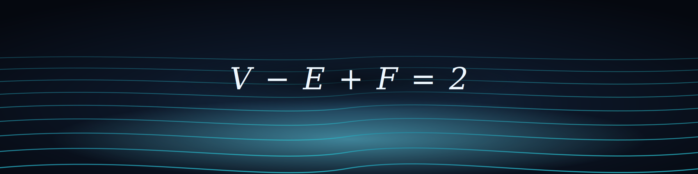

  

## Current focus

Two fronts, one toolchain — high-performance GPU/CUDA on NVIDIA Blackwell (sm_120):

- **Number theory & cryptography** — Miller-Rabin primality, prime gap searches, Pollard's Kangaroo (ECDLP on secp256k1), and empirical verification of the Beal conjecture.
- **Vesuvius Challenge** — Data augmentations for the Herculaneum scroll pipeline (May 2026 Progress Prize - https://scrollprize.org/winners). 

## Projects

- **[mr_blackwell](https://github.com/pscamillo/mr_blackwell)** — Native Miller-Rabin CUDA kernel for NVIDIA Blackwell. CGBN replacement using Montgomery CIOS and PTX carry chains.
- **[PSCKangaroo](https://github.com/pscamillo/PSCKangaroo)** — GPU-accelerated Pollard's Kangaroo for secp256k1 ECDLP. Fork of RCKangaroo with concurrent mode, crash-safe checkpoints, and compact 16-byte DPs.
- **[verimath](https://github.com/pscamillo/verimath)** — Deterministic, third-party-verifiable number-theory agent (factorization, primality proofs) on the CROO Agent Protocol. Every result ships with a reproducible SHA-256 attestation.
- **[beal_bigint](https://github.com/pscamillo/beal_bigint)** — GPU search for Beal conjecture counterexamples using the by-C^z parametrization. 20K+ hits validated, 0 counterexamples found.
- **[icicle-blackwell-ntt](https://github.com/pscamillo/icicle-blackwell-ntt)** — Empirical characterization of ICICLE NTT on consumer Blackwell (sm_120); profiling-driven, with a prototype for the digit-reversal bottleneck.
- **[bitcoin-puzzle-research](https://github.com/pscamillo/bitcoin-puzzle-research)** — Documented dead ends and empirically refuted approaches in Bitcoin puzzle research.

## Approach

Empirical before theoretical. Negative results published with the same rigor as positive ones.
